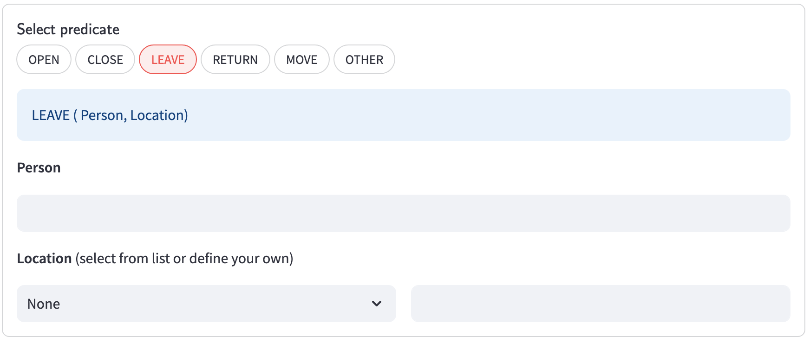
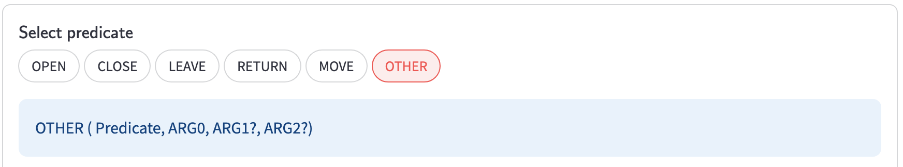
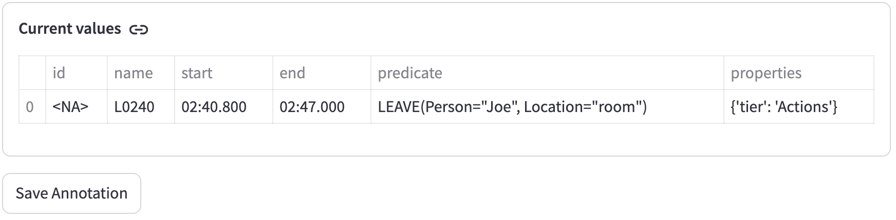

# Timeline Annotator Manual

[ [home](index.md) 
| [configuration](configuration.md)
| [object pool](objects.md)
| [**adding annotations**](adding.md)
| [viewing annotations](viewing.md)
]


## Adding Annotations

When you first start the tool you will get your home screen the top of which which will look something like below. In this case the tool was started with the configuration file in `config/actions.py`.


The default tool mode is to add annotations. The side bar on the left shows the total number of annotations and some controls: (1) tool mode selection, (2) video seek, (3) video size, and (4) controls specific to the selected mode. Some inputs in the sidebar may not be present in all tool modes.

Much of this should be self-explanatory, except perhaps for the video seek. When entering hours, minutes, seconds and milliseconds and then hitting return you will move the cursor on the video to the desired time point. You may enter any value larger than zero, for example, you could enter 200 seconds and the video cursor will move to the 200 second mark. A normalized value will always be displayed, for the 200 second mark it would be `<TimePoint 00:03:20.000>`.

In the main page you see the name of the video, the video itself, a slider to select the timeframe, an option to select a predicate (defined by the configuration) and a rendering of the current state of the annotation, which is pretty much empty, except potentially for some defaults that originate from the configuration. Notice also the warning below the annotation that says *Cannot add annotation yet because not all required fields have been specified and/or not all values are legal*. You can click the "Show issues" button and the tool will tell you that numerous fields are missing, including start and end points. Once you have filled in all needed values the warning will disappear and the "Show issues" button will be replaced by a "Save Annotation" button.

To add an annotation, you first watch part of the video to find something to annotate, possibly helped by the video seek. Then annotation is a four step process.


### Timeframe selection

To select the start and end of the timeframe to annotate, fill in the values below the video. For the screenshot above we had already selected 11 seconds and 15 seconds as the start and end points. The two rows of images show the one-second window around start and end point. Use the time values below the images to fine-tune the milliseconds. In this case you may want to use 11:400 for the start and 14:600 for the end.

If for your task a granularity of seconds is enough, then you can select "Hide boundary frames" and you will not even see those frames and you will not be bothered by fine-tuning.

In case you select an end time that falls beyond the end of the video then the tool will give you a warning and select the last second of the video for the end. You can still fine-tune though.

Finally, clicking the "Loop video" button will present a new video widget which will loop through the timeframe, tacking on a second at the start and the end.


### Selecting the predicate, its arguments and any properties

Next up is to select the predicate. The exact choices here are determined by the configuration, but you just select one of the choices and then fill in the arguments. The input widgets are preceded by a predicate signature, which tells you what arguments are expected and indicates whether an argument is required or not.



Optional arguments are followed by a question mark.



If properties were defined for the task then these will also be presented just like the arguments.


### Saving the annotation

Once all fields are entered you will notice that the values in the current annotations are all filled in, that the warning has disappeared, and that there now is a "Save annotation" button.



At this point you can click that button and the annotation will be saved in the JSON file in the `data` directory. One side-effect should be that the annotation count in the side bar should be incremented.


### Multiple annotation tasks on one document

It is possible to perform different kinds of annotations on the same video. For example, if we have a video named `some_vide.mp4` we could first start the tool using the action configuration:

```shell
$ streamlit run annotator.py some_vide.mp4 config/actions.py
```

Then after some annotation we can exit the tool and then start it up but now while using the gestures configuration:

```shell
$ streamlit run annotator.py some_vide.mp4 config/gestures.py
```

Since the video file name is the same the annotations will in both cases be written to `data/some_video.json`. To keep the annotations somewhat separate it is important that default tiers are defined appropriately (see the [configuration](configuration.md) section).