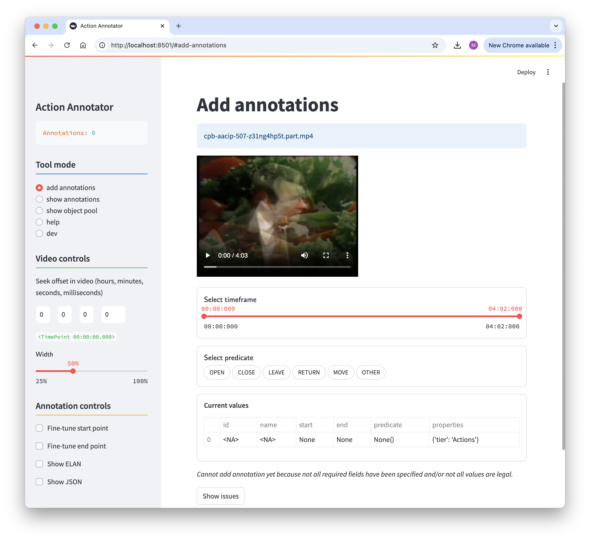
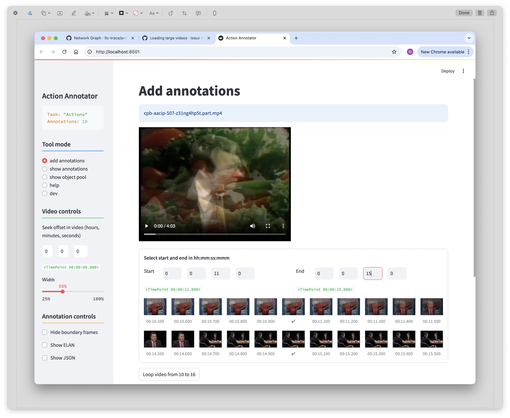
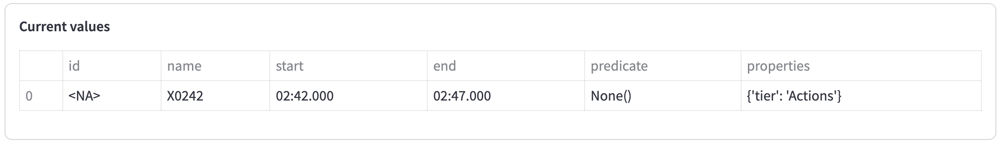
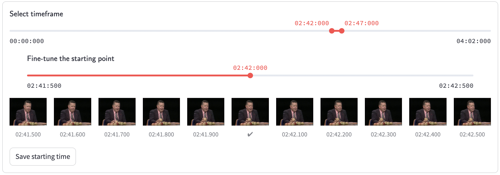
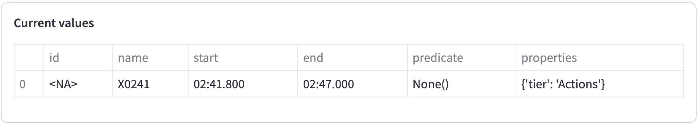

# Timeline Annotator Manual

[ [home](index.md) 
| [configuration](configuration.md)
| [object pool](objects.md)
| [**adding annotations**](adding.md)
| [viewing annotations](viewing.md)
]


## Adding Annotations

When you first start the tool you will get your home screen which will look something like below. In this case the tool was started with the configuration file in `config/actions.py`.



The default tool mode is to add annotations. The side bar on the left shows the total number of annotations (zero at the moment) and some controls: (1) tool mode selection, (2) video seek, (3) video size, and (4) control specific to the selected mode. Some inputs in the sidebar may not be present in all tool modes.

Much of this should be self-explanatory, except perhaps for the video seek. When entering hours, minutes, seconds and milliseconds and then hitting return you will move the cursor on the video to the desired time point. You may enter any value, for example, you could enter 200 seconds and the video cursor will move to the 200 second mark. A normalized value will always be display, for the 200 second mark it will be `<TimePoint 00:03:20.000>`.

In the main page you see the name of the video, the video itself, a slider to select the timeframe, an option to select a predicate (defined by the configuration) and a rendering of the current state of the annotation, which is pretty much empty, except potentially for some defaults that originate from the configuration. Notice also the warning below the annotation that says *Cannot add annotation yet because not all required fields have been specified and/or not all values are legal*. You can click the "Show issues" button and the tool will tell you that numerous fields are missing, including start and end points. Once you have filled in all needed values the warning will disappear and the "Show issues" button will be replaced by a "Save Annotation" button.

To add an annotation, you first watch the video to find something to annotate, possibly helped by the video seek. Then annotation is a four step process.


### Timeframe selection

Use the slider to select start and end times. Let's say we feel that there is an action starting at `<TimePoint 00:02:42.000>`, namely the guy is picking up a tomato:



Once you have selected this, the rendering of the current annotation will be updated (note the appearance of the name field, this is calculated automatically from the start and end times and it is used later when displaying annotations in a timeline):



If our timeframe selection operates at a granularity of seconds, we are done, but if we need the precision one order of magnitude larger (that is, tenths of seconds) we need to adjust the start and end times further. FOr example, for fine-tuning the start time we check "Fine-tune start point" in the sidebar, which will then give you the following.



Here you can select a frame within a one second window around the selected start point. The thumbnails will help you with that, they are somewhat small on a small screen, but you can do a mouse over and then click the little box that pops up to see a larger picture. You can then click the second timeline to pick a more precise start point.

If the one-second range misses the start of the annotation you can adjust the top slider (the one to select seconds).

> ⚠️ Sometimes when you are fine-tuning and you adjust the first timeframe slider a little bit to vigorously the tool may crash and you will have to restrart.

Let's say you decided that the tomato was picked at 02:41:800 and you selected that. Once satisfied you can click the "Save starting time" button and the start time will be updated. At that point the fine-tuning slider will disappear and the start value will be updated:



You can repeat the process for the end point.


### Selecting the predicate, its arguments and any properties

Next up is to select the predicate. The exact choices here are determined by the configuration, but you just select one of the choices and then fill in the arguments. The input widgets are preceded by a predicate signature, which tells you what arguments are expected and indicates whether an argument is required or not.


Optional arguments are followed by a question mark.


If properties were defined for the task then these will also be presented just like the arguments.


### Saving the annotation

Once all fields are entered you will notice that the values in the current annotations are all filled in, that the warning has disappeared, and that there now is a "Save annotation" button.


At this point you can click that button and the annotation will be saved in the JSON file in the `data` directory. One side-effect should be that the annotation count in the side bar should be incremented.


### Multiple annotation tasks on one document

It is possible to perform different kinds of annotations on the same video. For example, if we have a video named `some_vide.mp4` we could first start the tool using the action configuration:

```shell
$ streamlit run annotator.py some_vide.mp4 config/actions.py
```

Then after some annotation we can exit the tool and then start it up but now while using the gestures configuration:

```shell
$ streamlit run annotator.py some_vide.mp4 config/gestures.py
```

Since the video file name is the same the annotations will in both cases be written to `data/some_video.json`. To keep the annotations somewhat separate it is important that default tiers are defined appropriately (see the [configuration](configuration.md) section).