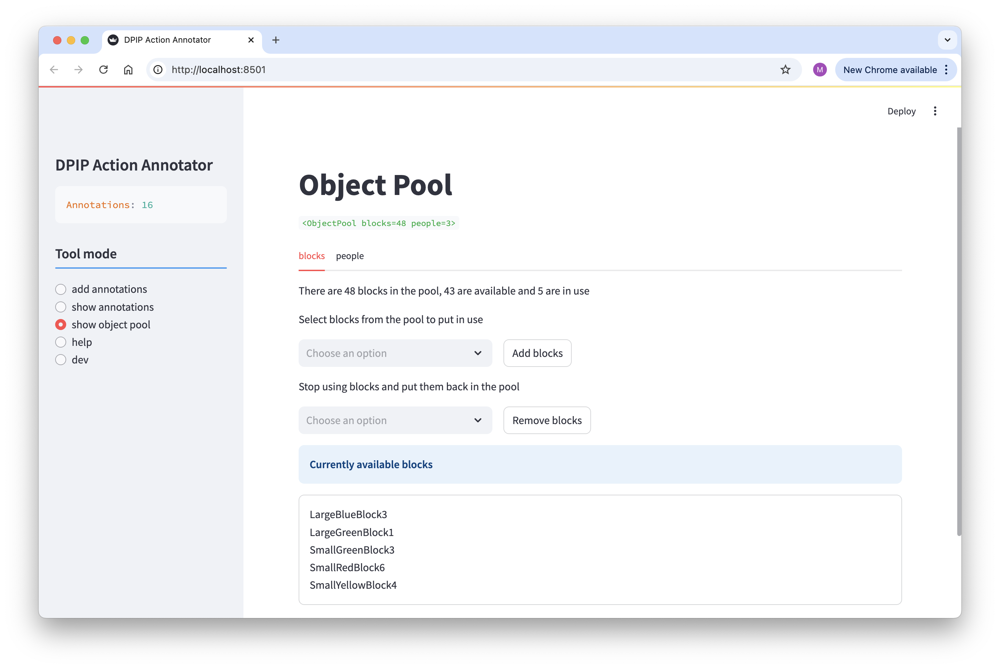

# Timeline Annotator Manual

[ [home](index.md) 
| [configuration](configuration.md)
| [**object pool**](objects.md)
| [adding annotations](adding.md)
| [viewing annotations](viewing.md)
]

## The Object Pool

> 🗒 The object pool is now only relevant to the task configured in `config/actions_dpip.py`.

The configuration files allow you to create exhaustive lists of possible values for some arguments or properties. This makes for a task where it is clear for the annotator what values there are and reduces mistakes. But if those lists get too big (say more than a a few dozen or so) then selecting an option becomes tedious. This is the case for the the DPIP action annotation task many arguments of predicates like MOVE are constrained to be on a predefined set of perhaps a hundred lego blocks, many of which will never be used in the annotation.

With the object pool you have the option to let the annotator decide what objects to put in play. This does require some work on setting up the configuration (see the [configuration](configuration.md) section), but with the configuration in place the annotator can select the "show object pool" tool mode and select the objects that are in play.

To see the object pool select the "show object pool" tool mode. In many case you will see nothing, but if you use the pool for an annotation task then the following will show up:

Select one of the tabs and add and remove objects as needed.

> ⚠️ There is an open issue where the tool pops into "add annotation" mode when you select an object from the pool. Simply go try again, the second time will not fail.

