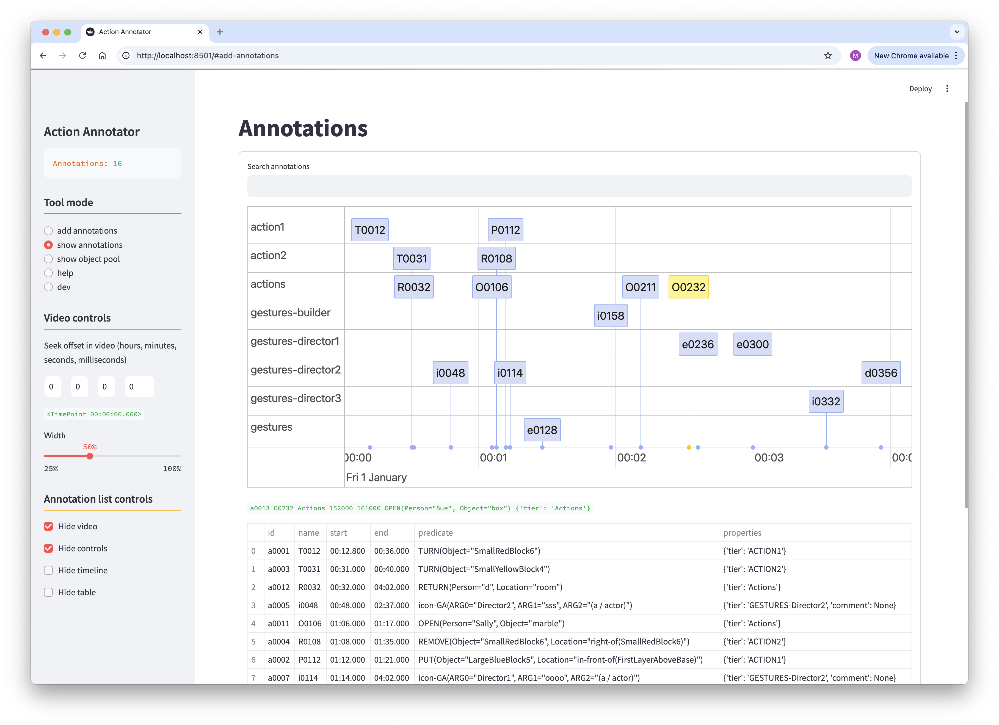

# Timeline Annotator Manual

[ [home](index.md) 
| [configuration](configuration.md)
| [object pool](objects.md)
| [adding annotations](adding.md)
| [**viewing annotations**](viewing.md)
]

## Viewing Annotations

To view all annotations select the "show annotations" tool mode. 

In this particular case the annotations file associated with the video has annotations from the four different tasks as described in the four configuration files bundled with the tool.

Clicking an item in the timeline generates a small representation of the seleced annotation immediately below the timeline.

Entering a search term restricts the displayed annotations to just the ones that match the search term. The match is on normalized strings in the identifier, predicate, arguments and properties.

When clicking the "Hide controls" checkbox you will get access to functionality to delete annotations and reload annotations.